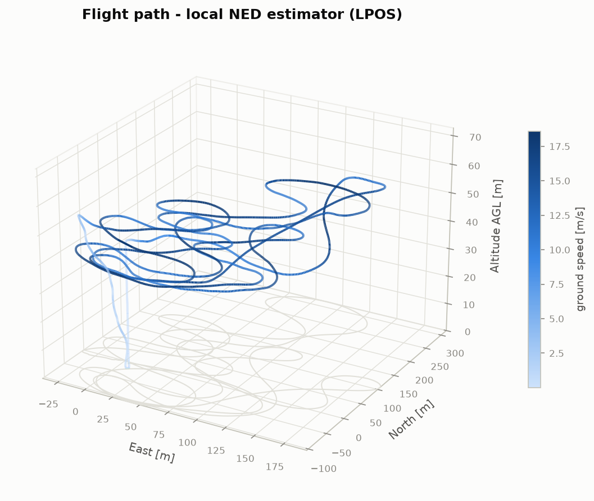
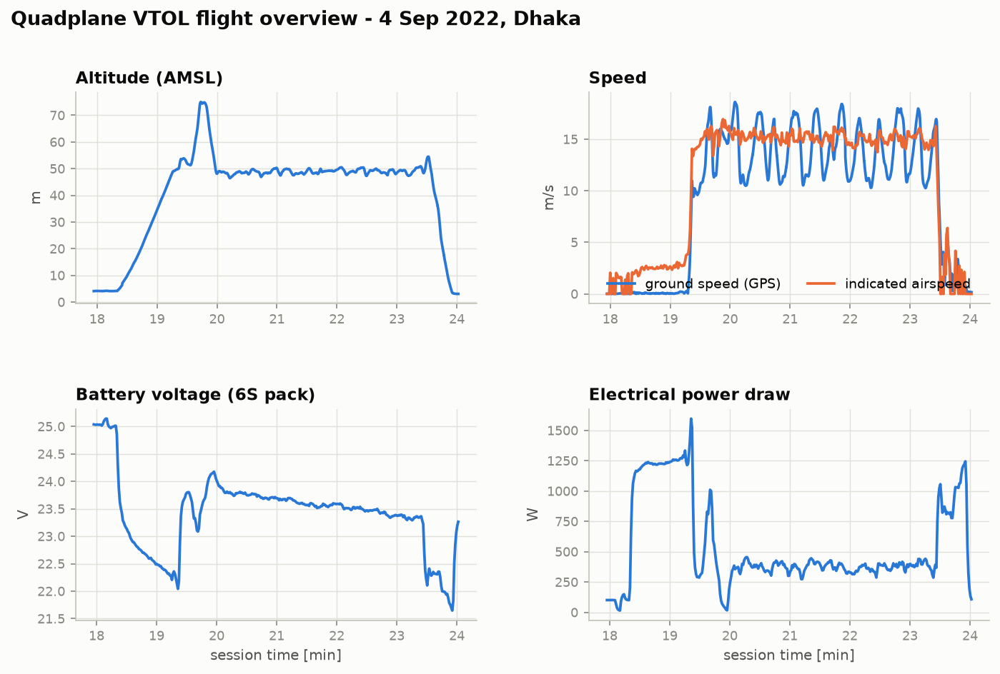
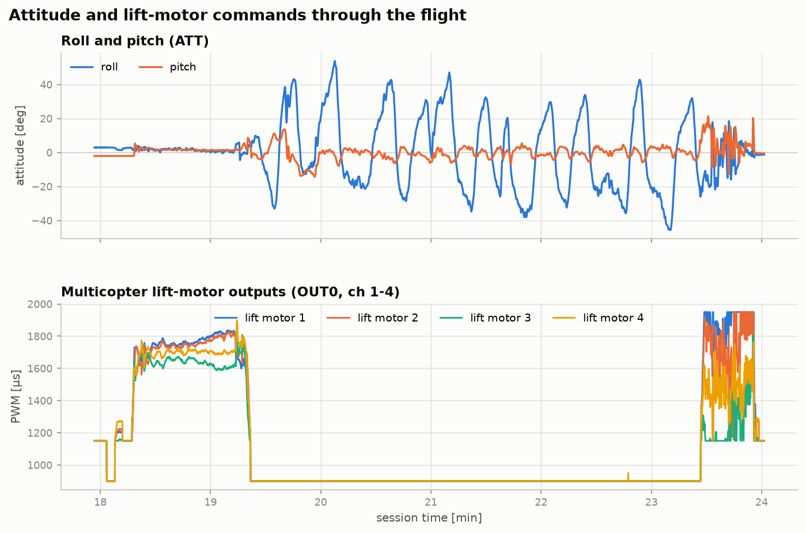
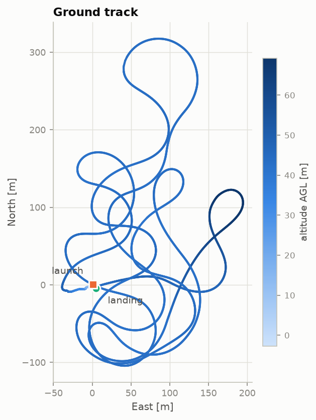

# Quadplane VTOL — Flight-Test Telemetry, CFD & Structural Data

[](LICENSE)
[](https://github.com/PX4/PX4-Autopilot/tree/v1.7.0)
[](analysis/plot_flight.py)
[](CITATION.cff)

Complete engineering dataset for a small **quadplane VTOL** (fixed wing + quad
lift motors): real flight-test telemetry through both hover ⇄ forward-flight
transitions, Ansys Fluent CFD of the S1223 wing, gust-response cases,
structural FEA, and the CAD geometry — with a Python toolkit that regenerates
every figure below straight from the raw logs.

> **Flight-Test Characterization and Design Implications of
> Hover-to-Forward-Flight Transition for a Small Quadplane VTOL Aircraft**
> Md Azizul Islam, Md Nur-A-Adam Dony\*, Mehedi Hasan, S. G. M. Hossain
> \* Corresponding author — `mdony42@tntech.edu`
> Journal manuscript, 2026 (under review)



## The flight at a glance

Recorded **4 September 2022** over an open agricultural field near Dhaka,
Bangladesh (23.85° N, 90.51° E). One battery, one continuous log: vertical
take-off on four lift rotors, transition to wing-borne cruise, ~4 min of
pattern flying, back-transition, and vertical landing.

| | |
|---|---|
| Log session / flight time | 24.0 min / ~6 min |
| Distance flown | **3.6 km** |
| Max altitude (AGL) | **69 m** |
| Cruise indicated airspeed | **≈ 15 m/s** (18.6 m/s peak ground speed) |
| Power in stable hover | **≈ 1 270 W** |
| Power in wing-borne cruise | **≈ 380 W — 3.4× less than hover** |
| Energy used | 2 695 mAh (6S Li-Po) |

That 3.4× hover-to-cruise power ratio *is* the quadplane argument, and you can
see it in the data:



The transition itself — quad lift motors throttle up for the vertical climb,
shut off completely at 19.4 min as the wing takes the load, then re-engage at
23.4 min for the back-transition and landing:





**Reproduce all figures** (≈10 s, no autopilot tooling required):

```bash
pip install -r analysis/requirements.txt
python analysis/plot_flight.py
```

---

## Repository map

```
├── data/telemetry/     13 PX4 topic CSVs from the flight log  → docs/DATA_DICTIONARY.md
├── analysis/           Python toolkit that generates figures/ from the CSVs
├── figures/            Flight-report figures (regenerable)
├── cfd/
│   ├── aoa-sweep/      Fluent pressure/lift/drag fields, α = −5° … +20°
│   ├── gust-cases/     Gust-perturbation lift & drag time-histories
│   ├── polars/         Aggregated Cl/Cd data (LiftDrag.xlsx) and plots
│   ├── flow-viz/       Streamlines, vectors, contours, residuals, case setup
│   └── projects/       Ansys Workbench projects (.wbpj + archives)
├── fea/                Wing structural FEA (deformation, stress, strain)
├── airfoil/            S1223 coordinates & meshing scripts (10″, 11.5″ chord, winglet)
├── cad/                SolidWorks parts, STEP export, AutoCAD drawing, renders
├── media/              Flight-test video
└── docs/               Data dictionary, paper source bundle (AIAA.zip)
```

---

## 1. Flight telemetry — `data/telemetry/`

Source binary log: `log_5_2022-9-4-18-02-56.px4log` (PX4 **v1.7.0**, legacy
`sdlog2` format), split into per-topic CSVs with `sdlog2_dump.py` from the
[PX4 v1.7.0 release tag](https://github.com/PX4/PX4-Autopilot/tree/v1.7.0).
Full column-level semantics: **[docs/DATA_DICTIONARY.md](docs/DATA_DICTIONARY.md)**.

| CSV | Topic | ~Rate | Highlights |
|---|---|---|---|
| `ATT.csv` | Attitude (quaternion, Euler, body rates) | 22 Hz | Transition body-rate peaks |
| `ATSP.csv` | Attitude setpoint | 22 Hz | Commanded pitch through transition |
| `ARSP.csv` | Attitude-**rate** setpoint (inner loop) | 86 Hz | Rate-controller commands |
| `AIRS.csv` | Airspeed (indicated / true) | 1 Hz | Transition speed, cruise IAS |
| `LPOS.csv` | Local NED position estimate | 22 Hz | 3-D trajectory, climb rates |
| `LPSP.csv` | Local position setpoint | event | Tracking error |
| `GPOS.csv` | Global position estimate | 22 Hz | Ground track, altitude |
| `GPS.csv` | Raw GNSS (+ the only absolute clock) | 1 Hz | Fix quality, 32 satellites |
| `OUT0.csv` | Actuator PWM, main bank | 10 Hz | Lift-motor shutoff / re-engagement |
| `RC.csv` | Pilot radio input | 9 Hz | Stick inputs |
| `BATT.csv` | Battery V / I / consumed mAh | 1 Hz | Per-phase power & energy |
| `PWR.csv` | 5 V rail health | 1 Hz | Power-system diagnostics |
| `STAT.csv` | System state (mode, arming, land detector) | event | Flight-phase segmentation |

> **Note.** `ARSP` in `sdlog2` is the attitude-*rate* setpoint topic, not
> airspeed — airspeed lives in `AIRS`. Newer PX4 releases use ULog (`.ulg`);
> the pipeline here is specific to the legacy `sdlog2` format.

## 2. CFD — Ansys Fluent, S1223 wing section

2-D angle-of-attack sweep with the SST k–ω turbulence model
(y⁺ ≲ 1 C-grid, V∞ = 15 m/s, ρ = 1.225 kg/m³, turbulence intensity 1 %).

- **`cfd/aoa-sweep/`** — pressure-field + integrated lift/drag exports at
  α = −5°, 0°, +5°, +10°, +15°, +20° (`AnsysSimu{α}AOA{Lift|Drag}.JPG`).
- **`cfd/gust-cases/`** — `15AoA{45|60}Gusted{2|4|6|8}MS{Lift|Drag}.jpg`:
  lift/drag time-histories at base α = +15° under 2–8 m/s gusts at 45°/60°
  orientation, plus static cases `{Lift|Drag}0AoA{30…135}Degree8ms.JPG`.
  The ~33 % gust lift-drop result in the paper comes from the 2 m/s case.
- **`cfd/polars/`** — [`LiftDrag.xlsx`](cfd/polars/LiftDrag.xlsx): the numeric
  C_L(α), C_D(α) data behind the paper's polar figure, with plot exports.
- **`cfd/flow-viz/`** — streamlines, velocity vectors, pressure contours,
  particle traces, residual/convergence history, and solver-setup screenshots.
- **`cfd/projects/`** — Ansys Workbench projects: `GustedWingProjectANSYS.wbpj`
  (AoA sweep) and `GustedWind.wbpj` (gust cases) + supporting archive.
  Requires Workbench 2022 R2 / 2023 R1 with a Fluent licence.

## 3. Structural FEA — `fea/`

Static pressure loading of the wing at 100 / 200 / 300 Pa equivalent inflow
pressure: total deformation (`Deform*Pa.JPG`), von-Mises and normal
stress/strain at 200 Pa, and the full Workbench Mechanical project
(`FEAWing_files.zip`).

## 4. Airfoil — `airfoil/`

The wing uses the low-Reynolds, high-lift **Selig S1223** section:
baseline coordinates (`S1223.xlsx`), chord scalings to 10″ and 11.5″,
winglet planform points, and the XFOIL/Fluent meshing scripts (`*.docx`).

## 5. CAD — `cad/`

SolidWorks wing and arm solids (`*.SLDPRT`), neutral `WingForSimu.STEP`
export for re-meshing in any tool, AutoCAD assembly drawing
(`Drawing1.dwg` / `Drawing1-Model.pdf`), and renders in `cad/renders/`.

## 6. Media — `media/`

Flight-test video from the 5 September 2022 session
([`VID-20220905-WA0012.mp4`](media/VID-20220905-WA0012.mp4)).

---

## Citing this work

If you use any data, figures, or analysis from this repository, please cite
the paper (machine-readable metadata in [`CITATION.cff`](CITATION.cff)):

```bibtex
@article{IslamDonyHossain2026Quadplane,
  author  = {Islam, Md Azizul and Dony, Md Nur-A-Adam and Hasan, Mehedi and Hossain, S. G. M.},
  title   = {{Flight-Test Characterization and Design Implications of
             Hover-to-Forward-Flight Transition for a Small Quadplane VTOL Aircraft}},
  year    = {2026},
  note    = {Journal manuscript under review}
}
```

Volume, pages, and DOI will be added on acceptance.

## License

Data, figures, and analysis code are released under
**[CC BY 4.0](LICENSE)**. Ansys project files are © the authors (CC-BY-4.0;
opening them requires your own Ansys licence — no Ansys software is
redistributed). The paper source bundle (`docs/AIAA.zip`) follows the
journal's author-rights policy.

## Contact

**Md Nur-A-Adam Dony** — `mdony42@tntech.edu`
Department of Electrical and Computer Engineering,
Tennessee Technological University, Cookeville, TN, USA
